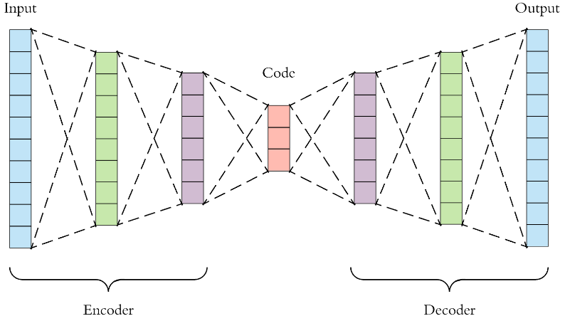
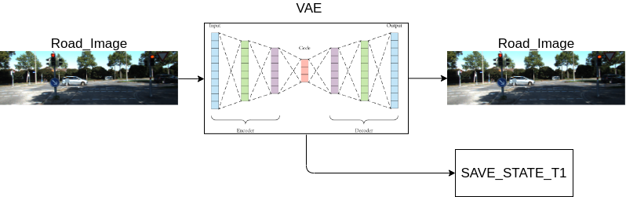
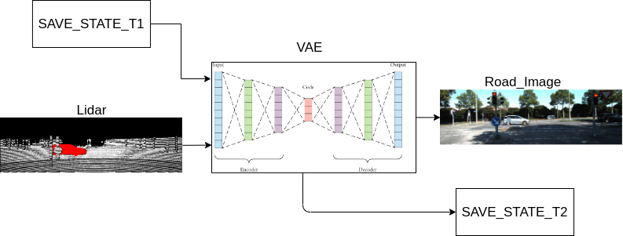
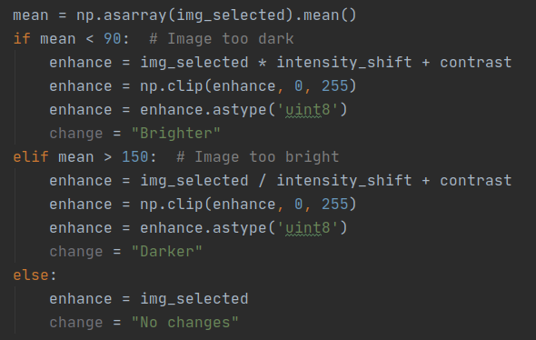
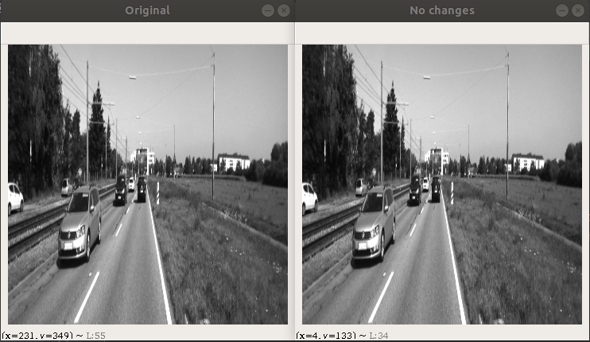
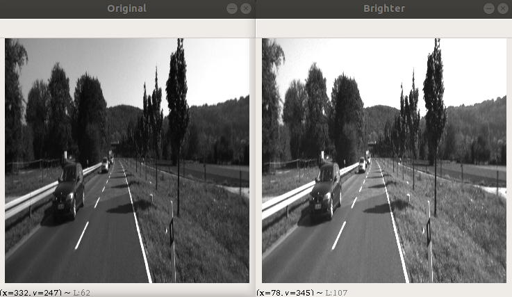
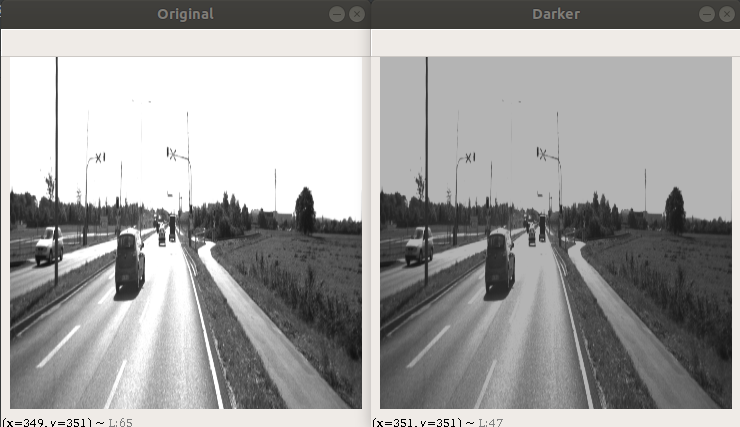
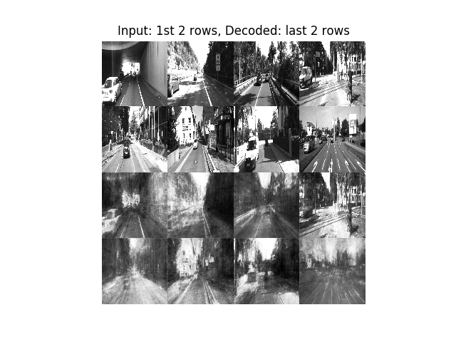
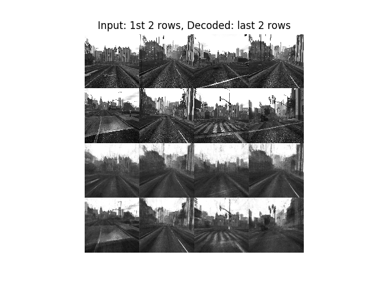
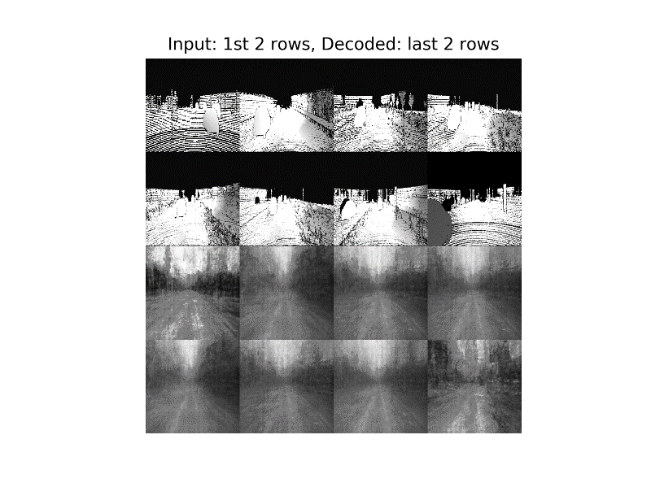

# Introduction
This project's main goal is to create an autoencoder which main function will be to create a camera-like image from a lidar-range image.

An AutoEncoder (AE) is a convolutional neural network composed by an encoder and a decoder, with a flatten middle layer.
In other words, it's a network composed by two different newtorks. 
The advantaje is that both tune themselves with the same training process.

# Training states
To obtain the desired results, the network must first to know the structures that form a road sceneview.
Thus, it cannot be trained with lidar images from the beggining.
The training will be separated in two different states:

  1. **Train with camera images**:
  This state will focus on the network to learn the structures from a driving scene.
  For it, the network is fed with camera images at the input and compared with the same images at the output. 
  
  
  2. **Train with range images**:
  At this state the network is fed at the input with a lidar-range image.
  The result is compared with a camera image at the output, corresponding at the same scene as the range image. 
  
  
For all states of training next datasets were used:

  - [KITTI dataset](http://www.cvlibs.net/datasets/kitti/)
  - [Unlimited Road-scene Synthethic Anotation (URSA)](https://uwaterloo.ca/waterloo-intelligent-systems-engineering-lab/ursa)

## Image normalization
Looking for a good eficiency, the expected image was set as a greyscale image.
Therefore, all images used at the network had to be in greyscale.
However there was a catch: images had to be normalized.

When speaking of image normalization, the most common normalization is to set the pixel value between 0 and 1.
This method of *absolute normalization* was not valid for the network.
The desired normalization was for the intensity of the image, so a small algorithm was created with numpy to do so.

In summary, the image normalization set all images with a mean value among 90 and 150. 
For it, the *intensity* value was set to 1.5 and *contrast* to 50

Image | Initial mean | Final mean
---------- | ---------- | ----------
 | 129.32 | 129.32
 | 87.83 | 125.70
 | 181.14 | 130.57

# AutoEncoder Results
The first training state was organized in several trainings to segregate trainings among datasets and to minimize the 
amount of images at each training.
This decision was taken because the setup that was in charge of training the network was not very poweful 
and all training were made by CPU.

Next table shows the results of the first state of training:
Dataset | Results
---------- | ----------
KITTI | 
URSA | 

After those trainings, the network was fed with range images without further training.
It was expected that the results weren't going to be excellent, but this test was made to observ if the net
could reconstruct some structures with minimal information.

As expected, all output images were very noisy.
However, it can be appreciated that all have the road identified and some have also vertical stuctures. 
Therefore, the net was trained as explained before and the following were the results.

These are the final results, which are quite acceptable.
However, the network deletes all vehicles from images.
This is consequence of the URSA dataset, which doesn't have vehicles in most of its scenes.

