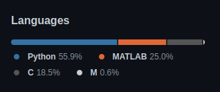

# Projects from Jaime Gonzalez

This repository is a description of the projects I've worked on. 
Although everything is explained, the code is not shared. 
However, all codes are safe at a private repository.
What I can show to you is the percentaje of all the codes: 

Every project will have its own folder with its readme file, where all the explanations will be. 
The link to each readme file will be listed below. 
Each project is also shortly explained below the list

## List of all projects

  - *Covid Friendly Face Detector* [(CFFD)](https://github.com/Jtachan/CV_projects/blob/main/covid_drowsiness_detector/readme-CFFD.md) 

## Covid Friendly Face Detector (CFFD)
Because of Covid-19 a very common sight is that everyone has a mask outside their homes. 
With the face partially covered, old face detectors might not work.

This project implements a CNN-based face detector with a re-trained 22-face-landmarks shape predictor.
The goal is to being able to detect any face (with or without mask) and predict drowsiness at the detected face. 

