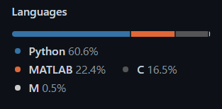
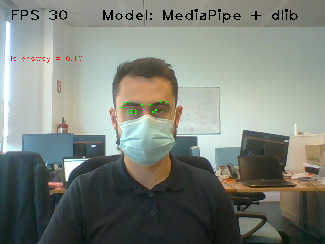

# Projects made by Jaime Gonzalez

This repository is a description of the projects I've worked on. 
All basic ideas are explained. 
However, not all codes can be shared. 
Private codes are safe at another private repository.
What I can show to you is the percentaje of all the codes (public and privates): 

Every project will have its own folder with its readme file, where all the explanations will be. 
The link to each readme file will be listed below. 
Each project is also shortly explained below the list

## List of all projects
Documented projects at this repository. 
Each one has a brief introduction below. 

  - *Python coding guide*
  - *Python extended utils*
  [(Python Coding)](https://github.com/Jtachan/CV_projects/tree/main/PythonCoding)
  - *Covid Friendly Face Detector* 
  [(CFFD)](https://github.com/Jtachan/CV_projects/blob/main/covid_drowsiness_detector/project-CFFD.md)
  - *DNN: Range AutoEncoder to Camera* 
  [(RAE2Cam)](https://github.com/Jtachan/CV_projects/blob/main/RAE2Cam/project-AE.md)
  - *Vehicle Model Predictor* [(VMP)](https://github.com/Jtachan/CV_projects/blob/main/VMP_6DoF/project-VMP.md)
    *with 6 DoF* 
  
**Projects yet to upload** (In progress)
  - *Radar 360 view*
  - *Fusion data from radars systems*
  - *Lidar Spherical Projection*

## Python coding guide
This repo contains an organized guide on how to program on Python. This is the knowledge I had adquire while working as a Python Engineer.
 The creation of this repository has two purposes:

- Demonstrate my knowledge on Python and show how I work on projects with it
- Help others not so experienced in Python to improve

[Link to repo](https://github.com/Jtachan/py-coding-hints)

## Python extended utils
The `Python extended utils` is a small installable package with a few extra classes.
The main purpose of the package is to show my organisation on coding and how these tools are documented.

The project contains the following classes:
* [**VideoHelper**](https://github.com/Jtachan/CV_projects/tree/main/PythonCoding#videohelper): Tool to open and write a video using the OpenCV package.
* [**ExtendedTestCase**](https://github.com/Jtachan/CV_projects/tree/main/PythonCoding#extendedtestcase): Base class of unittest.TestCase containing extra assert methods.

## Covid Friendly Face Detector (CFFD)
Because of Covid-19 a very common sight is that everyone has a mask outside their homes. 
With the face partially covered, old face detectors might not work.

This project implements a CNN-based face detector with a re-trained 22-face-landmarks shape predictor.
The goal is to being able to detect any face (with or without mask) and predict drowsiness at the detected face.
 

[Link to project](https://github.com/Jtachan/CV_projects/blob/main/covid_drowsiness_detector/project-CFFD.md)

## AutoEncoder: From Lidar-Range to Camera image (RAE2Cam)
When working with lidar systems at an automotive environment one of the main problems is to identify the scene at the lidar data.
This could be an easier problem to solve if the 3D Point Cloud Data (PCD) could be analyzed as an image, because
Computer Vision is a very wide field that already has a lot of background.

The main goal of this project was to create a Deep Neural Network (DNN), named AutoEncoder (AE), that could obtain 
a camera-like image from a lidar-range image.
An AE is a Convolutional Neural Network (CNN) composed by an encoder, a flat layer and a decoder in this order. 

[Link to project](https://github.com/Jtachan/CV_projects/blob/main/RAE2Cam/project-AE.md)

 

## Vehicle Model Predictor with 6-DoF (VMP)
This was my Final Bachelor's Degree Project at the University. 
The formal memory is also uploaded to the same file, however it's only in Spanish.

In it, a 6-DoF mathematical model is developed to be implemented as a predictor for a moving vehicle.
This model is to be used as the predictor inside a Kalman Filter to improve the results. 

[Link to project](https://github.com/Jtachan/CV_projects/blob/main/VMP_6DoF/project-VMP.md) 
[Link to University report](https://github.com/Jtachan/CV_projects/blob/main/VMP_6DoF/TFG_Jaime_Gonzalez_Gomez.pdf) (Spanish)

 
