# Covid Friendly Face Dectector (CFFD)

This is a Python3 application created to detect dowssiness. There are in fact two applications:
 1. The 68-landmark application (Not-CFFD)
 2. The 22-landmark application (CFFD)

For all applications to work is necesary to have the next Python packages:
 - dlib
 - mediapipe
 
Also, the file 'pointface_utils.py' is used as an external Python package. 
All codes are at the file 'Codes.zip', which is encrypted.

  **Warning**  
Both codes can detect and print the results for several faces.
However, they are designed to work only with one test subject and not several at the same time.

## Drowsiness detection
To detect drowsiness first is needed to locate the visual keys on a sleepy person. 
The keys selected for the algorithm are:
  - Eyes are close for long time periods
  - Eyes are blinking very fast

In other words, the algoritm will detect eye-blinks with help of a face shape model, which can detect eyelids.
A statistical variable will be updated for each frame with a face detection, changin its value between a minimum of 0.1 
and a maximum of 0.98.
This variable will increase each frame a blink is detected and will decrease if both eyes are open.

68-shape face | Blink detect | Drowsiness detect
------------ | ------------- | -------------
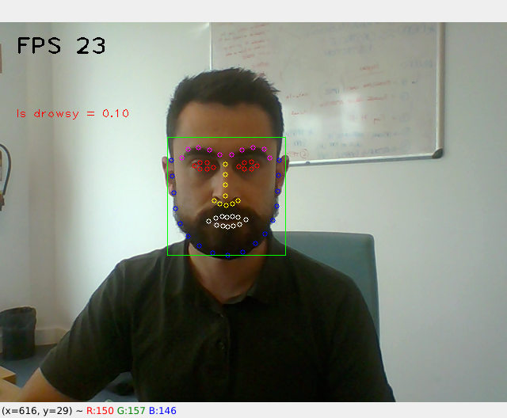 | 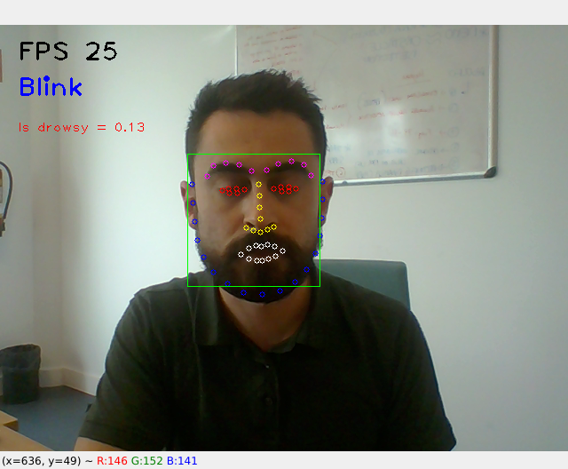 | 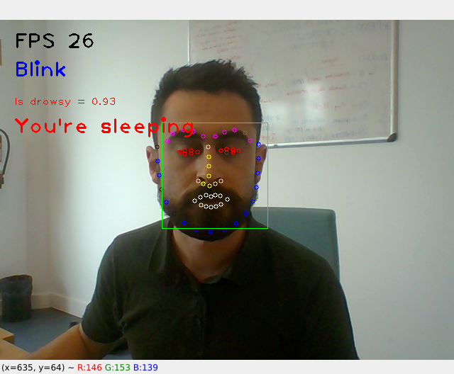

## 68-landmark application
This code works on people not wearing a mask. 
It works with the 68 face-landmarks shape model, which is not included in my repository but can easily be found.

  - 68 face-landmark model: 
  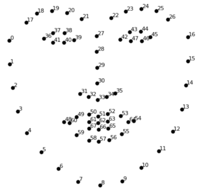
  
The benefit of this code is that, due all face points can de predicted, the blinking ratio updates automatically
if it detects someone starts or stops smiling.
This decition was made because it's common to close a bit the eyes when smiling, however that does not mean that person is blinking.

 
When the program starts it measures the eyes to get a blinking ratio.
It also measures the mouth lenght for the adaptive blinking ratio.

The code is made this way so it can work with anyone, no mater the shape and size of their mouth and eyes.

## 22-landmark application
This code work for detecting someone wearing a COVID-19 mask.
For it, a 22-face-landmark model was trained. The model is within the folder.

  - 22 face-landmark model: 
  
  
This code presents two main differences to the first one:
  1. Not all face points can be predicted, thus de mouth-eye blink adaptive ratio cannot work
  2. The face detector is from *MediaPipe* and not *dlib*

The dlib face detector might work fine for simple cases, however it starts failing if used to detect partially hidden faces.
MediaPipe presents a CNN-face detector and a landmark predictor, however it doesn't have enough landmarks to detect blinks.
Both are the reason to have a fusioned detector-predictor model.

After all changes, the mixed model CFFD shows some differences in comparation with the full-dlib-68-landmark application:
  - **Advantages**
    - It detects partially-occluded faces
    - It has a mean of 5~6 FPS faster
    - The 22-lmk model has 1/3 the size of the 68-lmk model
  - **Disadvantages**
    - The adaptive blinking ratio cannot be set

If the blink ratio needs to be updated it can be done by pressing the *SPACEBAR*

## Comparation

Not CFFD | CFFD
------------ | -------------
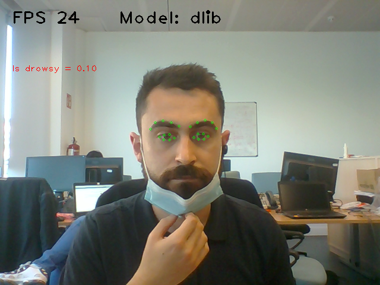 | 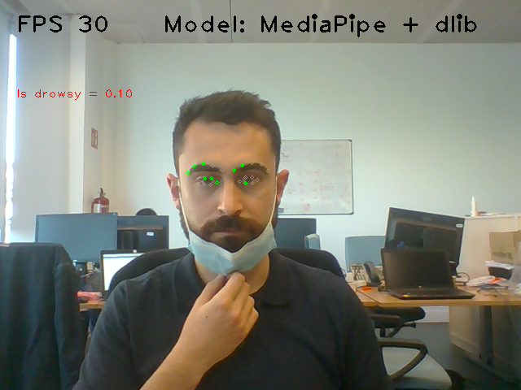
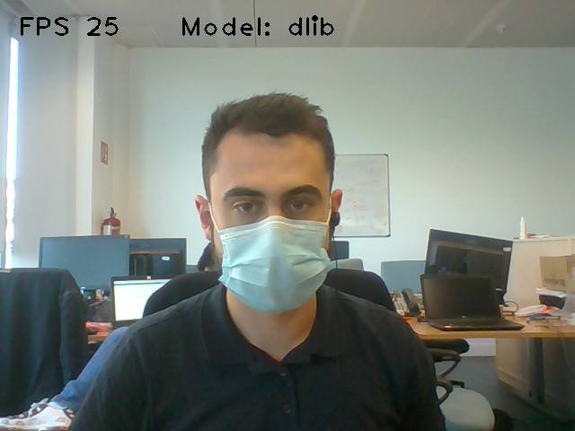 | 
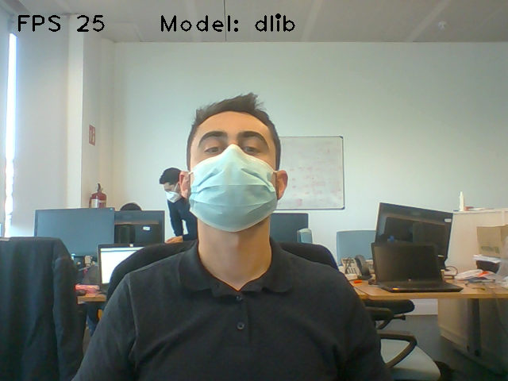 | 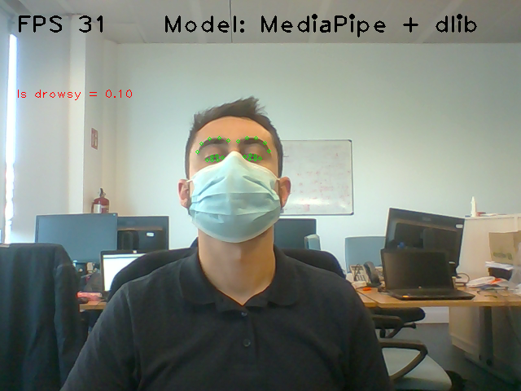
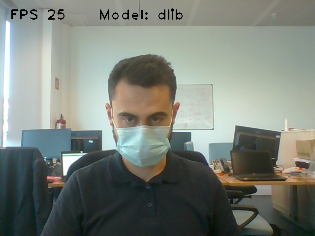 | 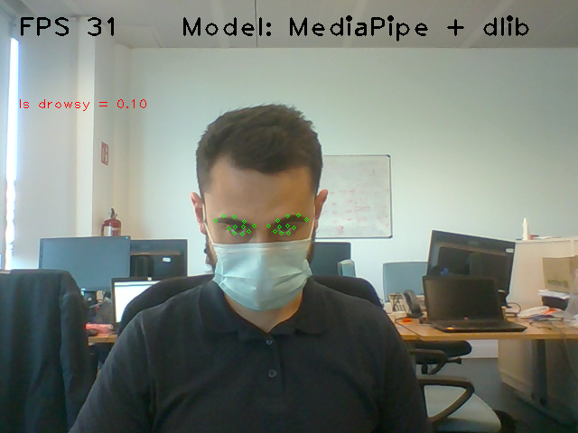
